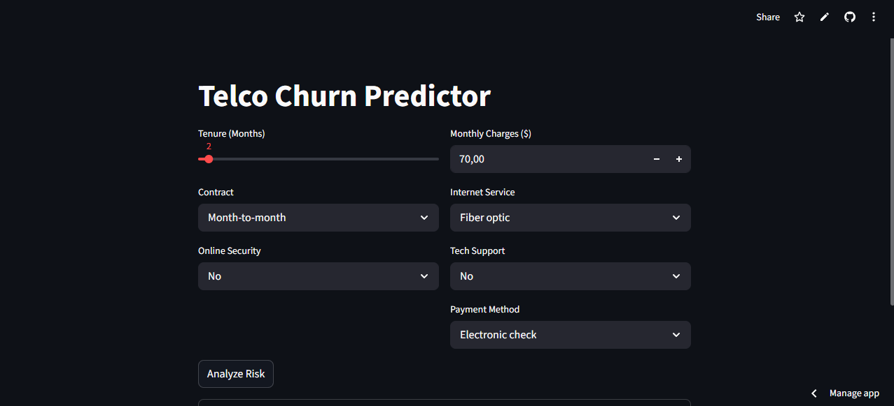

# Telco Customer Churn Predictor

An end-to-end Machine Learning web application that predicts the likelihood of a customer leaving a telecommunications provider. This project focuses on **cross-version model deployment** and **dynamic feature mapping**.



**[View Live Demo](https://xgboost-telco-customer-churn-prediction-kkf7fwm5uguxnqp7klxmfg.streamlit.app/)**

---

## Project Overview
Customer churn is one of the most costly challenges in the telecommunications industry, acquiring a new customer is significantly more expensive than retaining an existing one. This project builds a full end-to-end ML pipeline that takes raw customer data, trains an XGBoost binary classifier to identify who is likely to churn, and serves predictions through an interactive Streamlit web app. A key engineering focus was production reliability: rather than relying on Python pickles (which break across different runtime versions), the model is serialized in XGBoost's native JSON format, making it portable across environments. On the application side, a schema-driven input system quietly handles all One-Hot Encoding behind the scenes, so users interact with a clean, intuitive form instead of 30 raw feature fields. The result is a tool that bridges the gap between a data science notebook and a deployable business-facing product.

## Limitations
 
- **Class imbalance is the core bottleneck** — Both Random Forest and XGBoost were evaluated, and XGBoost was selected after GridSearch hyperparameter tuning. Even after optimization, the churn class (class 1) remains the weak point: F1-score of 0.57 vs. 0.85 for non-churn. This is a data problem more than a model problem — with only ~26% positive examples, the model is better at identifying loyal customers than catching actual churners. Techniques like SMOTE or cost-sensitive learning could help further.
- **GridSearch improved precision but traded off recall** — After GridSearch tuning, the optimized XGBoost improved churn precision (0.59 → 0.62) and overall accuracy (0.78 → 0.79), but churn recall slightly decreased (0.55 → 0.52). This reflects a classic precision-recall tradeoff: the model became more conservative, flagging fewer churners but being more confident when it does. Depending on business priority (catching more churners vs. avoiding false alarms), the decision threshold could be adjusted post-hoc.
- **Static dataset, single provider** — The model is trained on a single historical snapshot from one telecom provider (IBM Telco). It is not designed to generalize to other providers, regions, or time periods without retraining on fresh data.
- **No retraining or drift monitoring** — There is no automated pipeline to retrain or evaluate the model as customer behavior evolves over time. Predictions may become less reliable as market conditions change.
- **Limited behavioral signals** — Strong real-world churn indicators such as customer service call frequency, usage trends over time, and sentiment data are absent from the dataset and therefore not captured by the model.


## Key Features

- **Version-Independent Deployment** — Uses XGBoost's native `.json` format to ensure compatibility across Python environments (trained on 3.11, deployed on 3.13), completely bypassing the classic pickle version conflict.
- **Dynamic Feature Mapping** — Schema-based input system that maps raw user selections to a 30-feature One-Hot Encoded vector automatically.
- **Interactive Risk Assessment** — Real-time churn probability scoring with actionable business recommendations based on risk tier.
- **Optimized UI** — Built with Streamlit for a clean, professional dashboard suited for non-technical stakeholders.

---

## Tech Stack

| Layer | Tools |
|---|---|
| Modeling | XGBoost, Scikit-Learn |
| Data Processing | Pandas, NumPy, JSON Serialization |
| Frontend / Deployment | Streamlit |
| Environment | Python 3.13 (Deploy) / 3.11 (Train) |

---

## Technical Highlights

### 1. Solving the "Pickle" Version Conflict

Standard Python pickles break when the Python version differs between training and deployment environments. This project sidesteps that entirely by exporting the model in **XGBoost's native JSON format**, enabling a seamless handoff from the training environment to the Streamlit production server.

```python
# Save (training env — Python 3.11)
model.save_model("models/model.json")

# Load (deployment env — Python 3.13)
model = xgb.XGBClassifier()
model.load_model("models/model.json")
```

### 2. Schema-Aware Input Logic

The model was trained on **30 features** resulting from One-Hot Encoding. Rather than overwhelming users with 30 raw inputs, the app uses a `schema.json` blueprint to handle encoding automatically:

1. Load `schema.json` to know all expected column names
2. Initialize a zero-filled DataFrame matching the training schema
3. Dynamically map user-selected categories (e.g., `Contract: One Year`) to the correct encoded column (e.g., `Contract_One year`)

This keeps the UI simple while preserving full model compatibility.

---

## Model Performance
 
| Metric | Detail |
|---|---|
| Task | Binary Classification (Churn vs. No Churn) |
| Baseline Churn Rate | ~26% |
| Top Predictors | Contract Type, Fiber Optic Internet, Electronic Check Payment |
 
Both Random Forest and XGBoost were evaluated. XGBoost was selected for deployment based on its overall balance of precision and recall.
 
| Model | Class | Precision | Recall | F1-Score | Accuracy |
|---|---|---|---|---|---|
| Random Forest | No Churn (0) | 0.83 | 0.90 | 0.86 | 0.79 |
| Random Forest | Churn (1) | 0.63 | 0.49 | 0.56 | — |
| XGBoost | No Churn (0) | 0.84 | 0.86 | 0.85 | 0.78 |
| XGBoost | Churn (1) | 0.59 | 0.55 | 0.57 | — |

---

## Project Structure

```
TELCOCUSTOMERCHURNML/
│
├── datasets/
│   ├── TelcoCustomer.csv        # Raw dataset
│   └── cleaned_data.csv         # Preprocessed dataset
│
├── models/
│   ├── model.json               # Trained XGBoost model (Native JSON)
│   └── schema.json              # Feature schema for input mapping
│
├── notebooks/
│   ├── eda.ipynb                # Exploratory Data Analysis
│   └── train_model.ipynb        # Model training pipeline
│
├── app.py                       # Streamlit application
├── requirements.txt             # Production dependencies
└── README.md
```

---

## Run Locally

```bash
# 1. Clone the repository
git clone https://github.com/asymihoney/XGBoost-Telco-Customer-Churn-Prediction.git

# 2. Install dependencies
pip install -r requirements.txt

# 3. Launch the app
python -m streamlit run app.py
```

---

## Dataset

The project uses the [Telco Customer Churn dataset](https://www.kaggle.com/datasets/blastchar/telco-customer-churn), containing ~7,000 customer records with features including contract type, internet service, tenure, and monthly charges.
